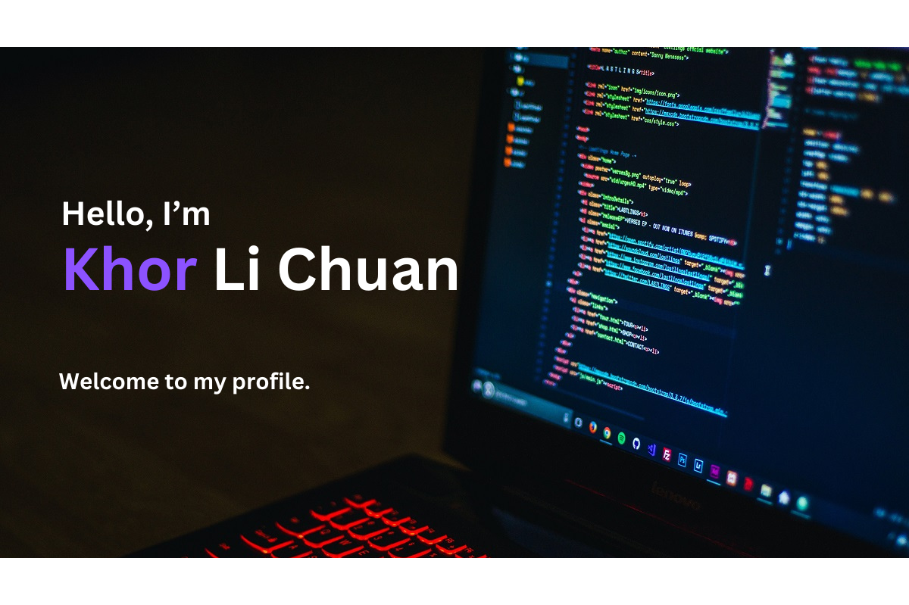

##  👋 Hello

My name is **Khor Li Chuan**, I am a self-taught full-stack web developer with a strong drive for continuous improvement and learning. My passion lies in exploring new technologies and transforming creative ideas into practical solutions through research and development.

Read more about my journey.

- **May 2019**: 🧑‍🍳 🔜 👨‍💻

  After working as a chef for two years, I came to realize that while I enjoy cooking as a hobby, the fast-paced kitchen environment wasn’t the right fit for me long-term. I decided to step away from that career path and revisit my earlier interest in computers—a field I had once considered for college. I took time to stay home, help my dad with his work, and fully dedicate myself to learning how to code and building a new path as a developer.

  I took a hands-on, self-disciplined approach to learning. I wrote detailed notes in a notebook, making sure I truly understood the theory and concepts behind everything I was learning — especially since I didn’t have anyone to ask for help.

  

    
Learning process

  I began with the basics: HTML, then moved on to CSS. I initially struggled with layout — especially splitting content into left and right sections — until I discovered Flexbox and Grid, which made layout so much easier and intuitive.

  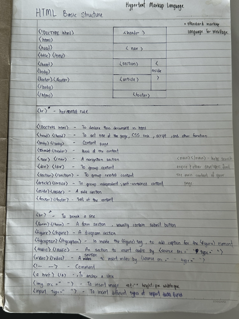

  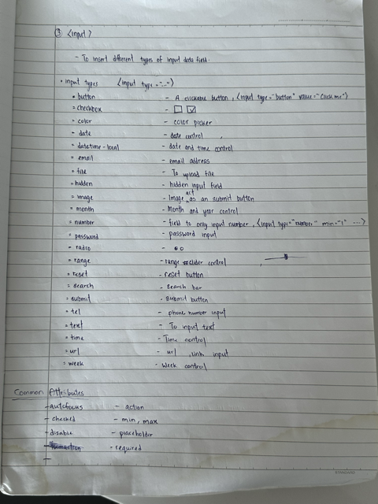

  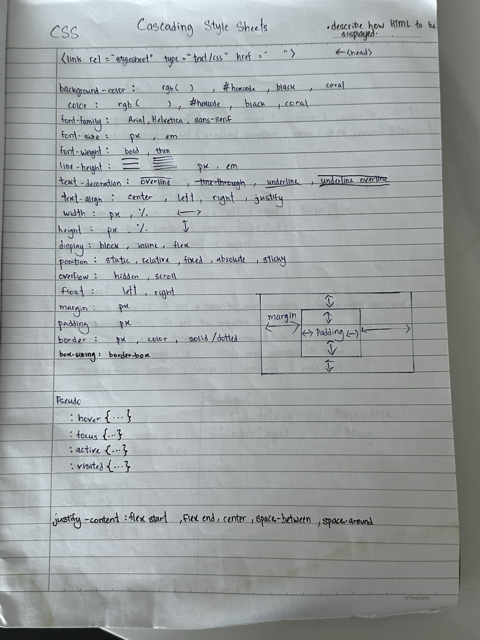

  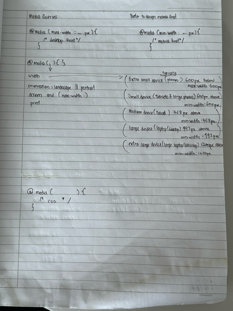

  Next came JavaScript, which took me quite a while to grasp. I spent a lot of time practicing through coding challenges and algorithms to build a strong foundation.

  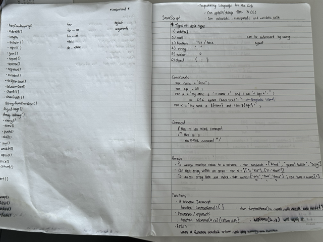

  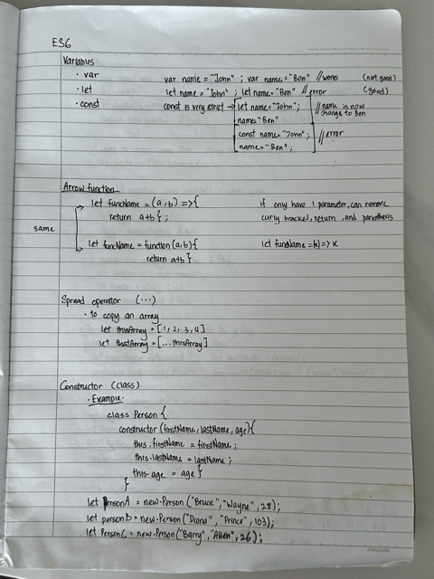

  Once I was comfortable with JavaScript, I moved on to DOM manipulation and jQuery — the point where I really started to see JavaScript come to life in real web interactions.

  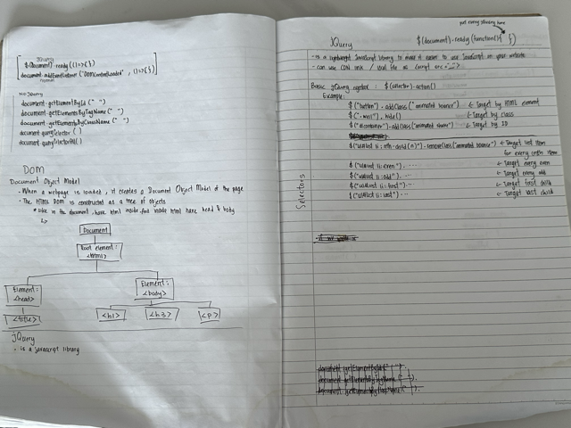

  I also learned how to work with APIs using AJAX, and explored data visualization tools like D3.js, which I didn’t use much at the time but now recognize as a very powerful tool.

  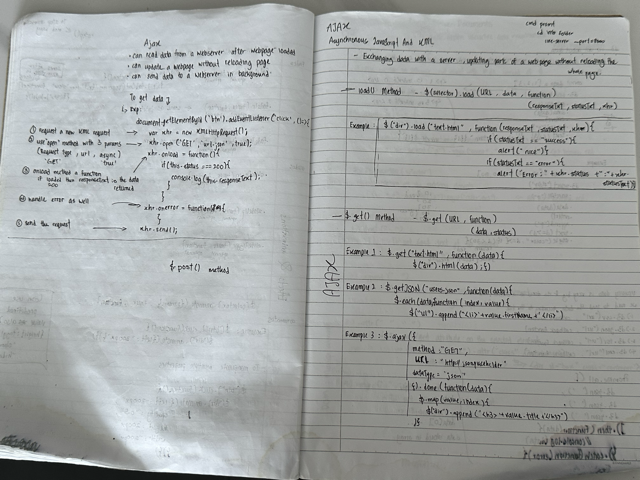

  

  Eventually, I dove into ReactJS, which took a lot of effort to fully understand. I spent time learning the underlying theory, how components work, and how to manage state effectively — including with Redux.

  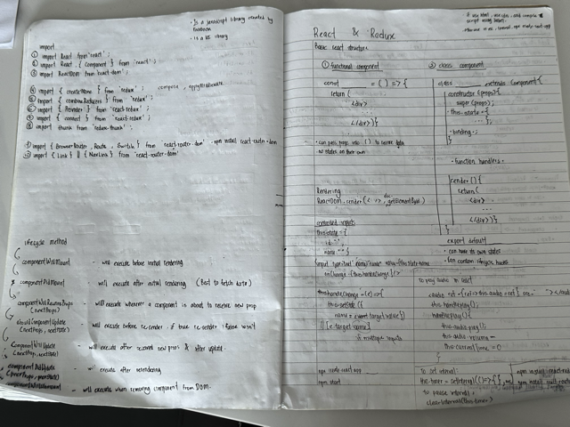

  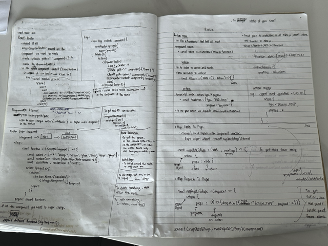

  After that, I transitioned toward full-stack development. I learned Node.js, built servers using Express.js, and worked with Passport sessions and JWT for authentication.

  

  

  

  

  I used MongoDB as my main database, and explored web security tools like Helmet and Bcrypt. I also practiced writing tests using libraries such as Mocha & Chai and Jest.

  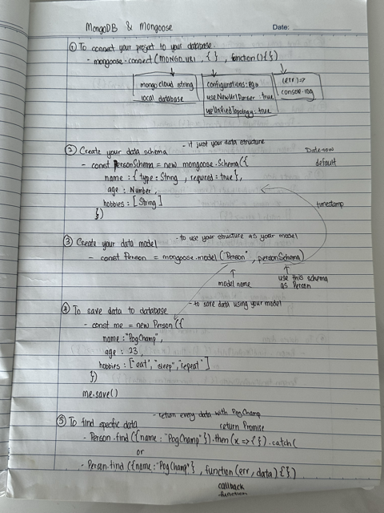

  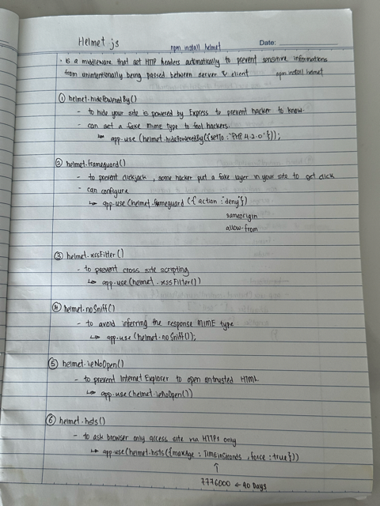

  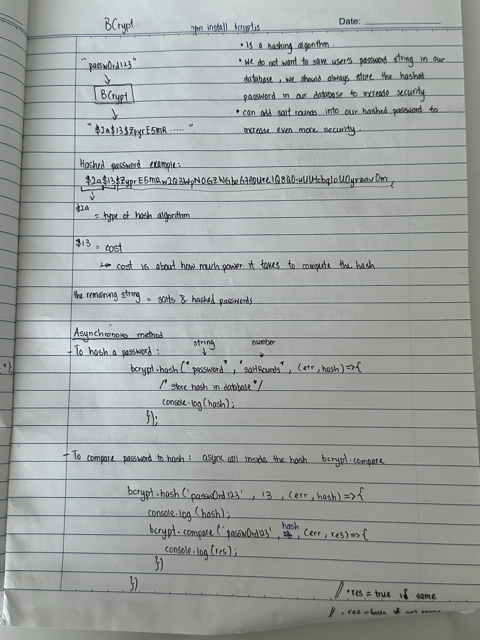

  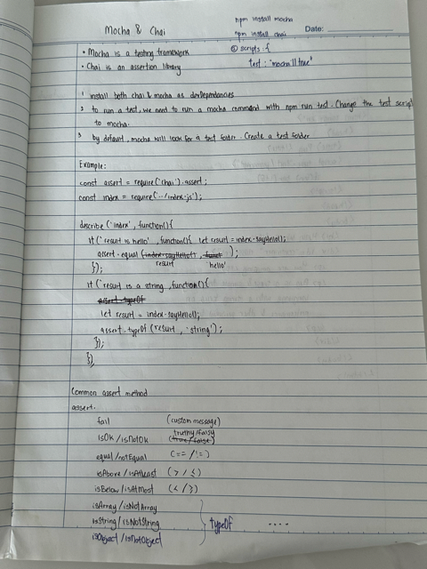

  Along the way, I picked up Socket.io for real-time communication and became comfortable using Git for version control.

  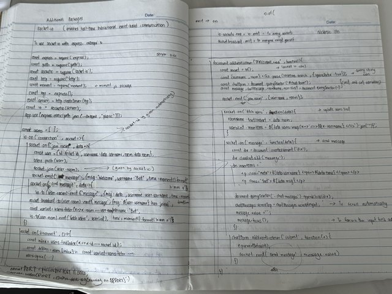

  And just out of curiosity, I even started experimenting with React Native to explore mobile development.

  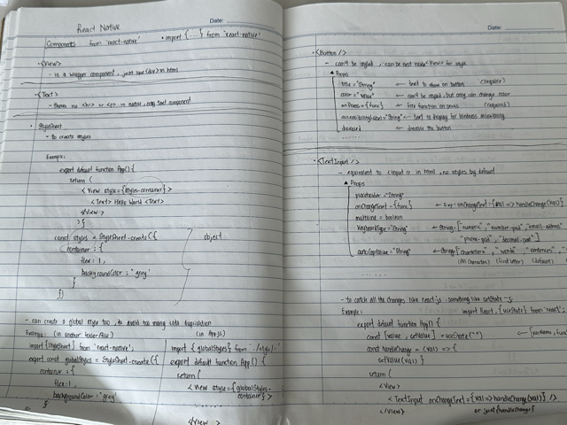

  🥹Up until now I cannot believed that I did all these.🥹
  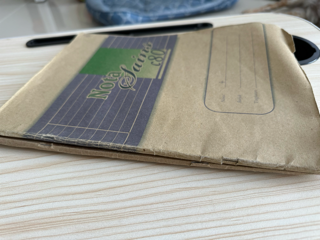
  

- **March 2020**:

  After spending 10 months learning to code at home, I gained a solid understanding of full-stack development. I built my own portfolio and began applying for jobs. After countless applications and being ghosted many times, I finally received a response — an invitation to interview.

  I was both excited and nervous — probably a mix of anticipation and a bit of impostor syndrome creeping in. As part of the interview, I was asked to complete a technical test by building a small app. I gave it my all, completed the challenge, and was thrilled to be offered the position. I officially joined the company as their first hire, marking the start of my professional journey as a developer.

- **May 2020**:

  On May 2nd, 2020, I officially began my journey as a full-stack developer.

  Since then, I’ve experienced exponential growth in my skills and responsibilities. Some of the key contributions and milestones during my time there include:

1. Laid the foundation for the company’s technology stack.
2. Developed an in-house app to monitor the status of IoT devices.
3. Mentored interns and guided them in building applications used by the company and delivered as vendor solutions to our partners.
4. Revamped the company’s main product by migrating the frontend from a Mustache-based view engine to ReactJS.
5. Restructured the backend and optimized the database, including a full data migration from MongoDB to PostgreSQL.
6. Gained hands-on experience with Linux (Ubuntu), using Vim and configuring Nginx for server deployment.
7. Continued exploring and implementing tools and workflows that improved development efficiency and system performance.

- **July 2024**:

  Our company decided to officially merge with our long-time partner — a marketing company for whom we had frequently developed projects as a vendor. With the merger, we became their in-house software team, allowing us to collaborate more closely and reduce miscommunication by eliminating the need for constant online coordination.

  During this period, I took on a more active role in project management, shifting slightly away from hands-on development to focus on planning, aligning teams, and ensuring project goals were met efficiently.

- **February 2025**:

  After spending nearly five years with the company, I felt it was the right time to take the next step in my career. I’m now looking to move onto a larger platform where I can challenge myself further, work with new technologies, and continue growing as a developer.

##  💻 Skills

- **Language**:

   

- **Front End**:

        

- **Back End**:

    

- **Database**:

       

- **Testing**:

   

- **Others**:

            

## 🔭 I'm currently working on

I'm currently in the process of updating my portfolio, which I haven’t maintained for a while. Alongside that, I’ve been catching up on newer technologies that I haven’t had the chance to work with before to broaden my skill set and stay current with industry trends.

## 📈 Stats

